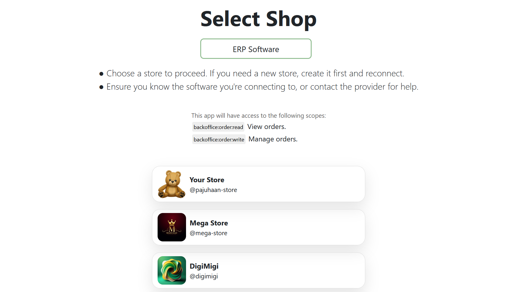
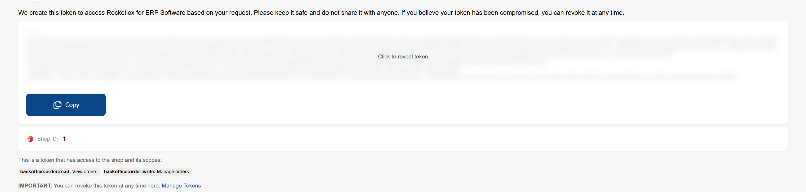
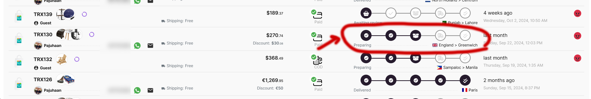

# ERP Integration + Selldone Shops

Integrate your ERP software with Selldone shops seamlessly. This guide will help you quickly connect your ERP system to
Selldone, enabling you to manage orders efficiently.

## Overview

Since ERP software often runs on local machines, you need to create a token for each shop to connect securely without
requiring any server-side code. Selldone provides a simple method for generating personal tokens to facilitate secure
connections with third-party software.

🎞️ **[How It Works Demo Video](https://demo.selldone.com/demo/cm2yjk5sh32o9esgv6ckru79r)**

[](https://youtu.be/60bsxi1BUAA)

✨ **[Fetch Orders Demo](https://selldone.github.io/erp/orders-list.html)**

✨ **[Update Order Demo](https://selldone.github.io/erp/order-update-state.html)**

✨ **[Set Order Tracking Demo](https://selldone.github.io/erp/order-set-tracking.html)**

## Token Generation

### Step 1: Select Shop

**Important:** The user must be logged in to Selldone.

Create a link with the following format:

```
https://selldone.com/auth/erp?scopes[]=selldone:identification&scopes[]=backoffice:shop:read&scopes[]=backoffice:order:read&scopes[]=backoffice:order:write&scopes[]=backoffice:product:read&scopes[]=backoffice:category:read
```

🌐 Localized urls are supported:

```
https://zh.selldone.com/auth/erp?scopes[]=backoffice:order:read&scopes[]=backoffice:order:write
```

When the user accesses this link, they can select their shop from the page:



### Step 2: Token Generation

After selecting the shop, the user will be redirected to a page displaying the token:



### Managing Tokens

You can view and revoke created tokens by visiting:

[https://selldone.com/developer/access](https://selldone.com/developer/access)

## API: Get Orders

To fetch orders from a Selldone shop, send a `GET` request to the following endpoint:

```
https://api.selldone.com/shops/{shop-id-here}/process-center/baskets-PHYSICAL?offset=0&limit=10&sortDesc=true&statuses[]=Payed&with[]=items&with[]=buyer&with[]=products
```

Replace `{shop-id-here}` with the actual shop ID.

This endpoint returns a list of `PHYSICAL` orders with full details. The maximum `limit` is **250**.

### Order Types

For ERP systems, you typically need to work with **physical** (goods) orders. Selldone supports various order types,
including:

- `PHYSICAL`    ERPs work only with this.
- `FILE`
- `SERVICE`
- `VIRTUAL`
- `SUBSCRIPTION`

### Response Structure

The response contains two main fields:

- `orders`: An array of orders.
- `total`: The total number of orders.

By default, the endpoint returns the most recent orders first. You can sort the results by adding `sortBy=reserved_at`
and `sortDesc=false` to the query string.

### Testing the Fetch Orders Endpoint

✨ **[Fetch Orders Demo](https://selldone.github.io/erp/orders-list.html)**.

### Query Parameters

The endpoint accepts the following query parameters:

- **`offset`** *(integer, min: 0)*: The starting point of records.
- **`limit`** *(integer, min: 1, max: 250)*: The number of records to return.
- **`sortBy`** *(string, optional)*: The field to sort by (e.g., `reserved_at`).
- **`sortDesc`** *(boolean, optional)*: Whether to sort in descending order.
- **`statuses`** *(array of strings, optional)*: The order statuses to filter by. Valid values are `Open`, `Reserved`,
  `Payed`, `Canceled`, `COD`. If not provided, `Payed` and `COD` are considered by default.
- **`product_id`** *(integer, optional)*: Filter orders containing a specific product.
- **`affiliate_id`** *(integer, optional)*: Filter orders associated with a specific affiliate.
- **`customer_id`** *(integer, optional)*: Filter orders placed by a specific customer.
- **`with`** *(array of strings, optional)*: Include related data. Valid values are `items`, `buyer`, `connect_orders`,
  `products`, `payment`.

### Synchronizing Orders

To synchronize orders without fetching all orders every time, use the `updated_at` query parameter. Send the last sync
date as a timestamp (integer), and the endpoint will return orders updated after this date.

### Order Structure

Below is an overview of the important parameters returned in the order data, which are critical for ERP software
integration:

| **Parameter**                              | **Description**                                                                                                                                                                                                                                                                                                                                                                                                                                                                                                            |
|--------------------------------------------|----------------------------------------------------------------------------------------------------------------------------------------------------------------------------------------------------------------------------------------------------------------------------------------------------------------------------------------------------------------------------------------------------------------------------------------------------------------------------------------------------------------------------|
| **Order ID (`id`)**                        | Unique identifier for the order, used for tracking and managing orders.                                                                                                                                                                                                                                                                                                                                                                                                                                                    |
| **Customer ID (`customer_id`)**            | Unique identifier for the customer placing the order.                                                                                                                                                                                                                                                                                                                                                                                                                                                                      |
| **Order Type (`type`)**                    | Type of order (e.g., `PHYSICAL`, `SERVICE`), determining the fulfillment process.                                                                                                                                                                                                                                                                                                                                                                                                                                          |
| **Order Status (`status`)**                | Current status of the order (e.g., `Payed`, `Pending`). Possible values: `Open`, `Reserved`, `Payed`, `Canceled`, `COD`. Since we are fetching `Payed` orders, this value will be `Payed`.                                                                                                                                                                                                                                                                                                                                 |
| **Order Price (`price`)**                  | Total price of the order.                                                                                                                                                                                                                                                                                                                                                                                                                                                                                                  |
| **Currency (`currency`)**                  | Currency used in the order.                                                                                                                                                                                                                                                                                                                                                                                                                                                                                                |
| **Delivery Price (`delivery_price`)**      | Cost of delivering the order to the customer.                                                                                                                                                                                                                                                                                                                                                                                                                                                                              |
| **Delivery State (`delivery_state`)**      | Current state of the delivery process. Possible values: `CheckQueue`, `OrderConfirm`, `PreparingOrder`, `SentOrder`, `ToCustomer`.                                                                                                                                                                                                                                                                                                                                                                                         |
| **Receiver Information (`receiver_info`)** | Information about the recipient for fulfilling the delivery. This includes: <br/> - **Name (`name`)**: Name of the recipient. <br/> - **Phone (`phone`)**: Phone number of the recipient. <br/> - **Address (`address`)**: Full delivery address. <br/> - **City, State, Country**: Location details for shipment. <br/> - **Postal Code (`postal`)**: Postal/ZIP code. <br/> - **Location (`location`)**: GPS coordinates for precise delivery.                                                                           |
| **Items (`items`)**                        | List of items within the order, essential for inventory and fulfillment. Each item includes: <br/> - **Item ID (`id`)**: Unique identifier of the item in the order. <br/> - **Product ID (`product_id`)**: Identifier of the product being ordered. <br/> - **Variant ID (`variant_id`)**: Identifier of the product variant, if applicable. <br/> - **Quantity (`count`)**: Number of units ordered. <br/> - **Price (`price`)**: Price of each item. <br/> - **Currency (`currency`)**: Currency used for item pricing. |
| **Product Information (`product`)**        | Details about the product, including: <br/> - **SKU (`sku`)**: Stock Keeping Unit for inventory tracking. <br/> - **MPN (`mpn`)**: Manufacturer Part Number for product identification. (If the product has multiple variants, refer to `variant.sku` and `variant.mpn`.)                                                                                                                                                                                                                                                  |
| **Variant Information (`variant`)**        | Details about the product variant, if applicable. Includes: <br/> - **SKU (`sku`)**: Variant-specific SKU. <br/> - **MPN (`mpn`)**: Variant-specific MPN.                                                                                                                                                                                                                                                                                                                                                                  |
| **Buyer Information (`buyer`)**            | Information about the buyer (can be `null` if it's a guest shop). Includes: <br/> - **Name (`name`)**: Name of the buyer. <br/> - **Email (`email`)**: Email address for communication. <br/> - **Phone (`phone`)**: Phone number of the buyer.                                                                                                                                                                                                                                                                            |
| **Checkout Date (`reserved_at`)**          | Timestamp of when the order was checked out.                                                                                                                                                                                                                                                                                                                                                                                                                                                                               |

[**More details about response structure.**](./response-structure.md)

---

## API: Update Order

This guide provides instructions on how to update order statuses using the Selldone API. It outlines the steps of order
fulfillment and how to communicate these updates through API calls.

### Updating Order Status

You can update the status of orders by sending a `POST` request to the following endpoint:

```plaintext
https://api.selldone.com/shops/{shop-id-here}/process-center/baskets/{order-id-here}/state
```

Replace `{shop-id-here}` with your actual shop ID and `{order-id-here}` with the specific order ID.



Selldone defines 5 steps in the order fulfillment process, which you can manage by updating the `delivery_state`
parameter. Each state should be called sequentially after the previous one.

#### 1. Confirm Order (`OrderConfirm`)

This step indicates that the order has been reviewed and confirmed.

**Parameters:**

- `state`: `OrderConfirm`
- `list`: An array of `item.id`s that are confirmed. If you cannot fulfill an item, do not include its ID in this list.
  This helps the merchant understand how much to refund to the buyer in the Selldone panel. `null` means all items are
  confirmed.

```bash
curl -X POST "https://api.selldone.com/shops/12345/process-center/baskets/67890/state" \
     -H "Content-Type: application/json" \
     -H "Authorization: Bearer abcdef123456" \
     -d '{
           "state": "OrderConfirm",
           "list": [23990, 23991]
         }'

```

Response 200:

```json
{
  "delivery_state": "OrderConfirm",
  "updated": 2,
  "changed": true,
  "items": [
    {
      "id": 23990,
      "basket_id": 15002,
      "product_id": 2346,
      "variant_id": null,
      ...
    },
    ...
  ]
}

```

#### 2. Prepare Order (`PreparingOrder`)

At this stage, you set packaging information and indicate that the order is ready to ship (e.g., ready for courier
pickup).

**Parameters:**

- `state`: `PreparingOrder`
- `delivery_info`: If there are no changes to `delivery_info`, send the original `order.delivery_info` in this
  parameter. `null` means no changes.

```bash
curl -X POST "https://api.selldone.com/shops/12345/process-center/baskets/67890/state" \
     -H "Content-Type: application/json" \
     -H "Authorization: Bearer abcdef123456" \
     -d '{
           "state": "PreparingOrder",
           "list": null,
           "delivery_info": {
             "distance": 11312.99,
             "volume": {
               "width": 0,
               "length": 0,
               "height": 0
             },
             "weight": 0,
             "days": ["Sunday", "Monday", "Tuesday", "Wednesday", "Thursday", "Saturday"],
             "time_spans": ["Morning", "Evening"],
             "custom": false,
             "type": "Cargo",
             "connect_delivery": 0,
             "inbound_delivery": 2,
             "outbound_delivery": 0,
             "vendor_delivery": 0,
             "date": null
           }
         }'

```

Response 200:

```json
{
  "delivery_state": "PreparingOrder",
  "changed": true
}

```  

#### 3. Send Order (`SentOrder`)

Use this when the order has been shipped (e.g., handed over to DHL).

**Parameters:**

- `state`: `SentOrder`

```bash
curl -X POST "https://api.selldone.com/shops/12345/process-center/baskets/67890/state" \
     -H "Content-Type: application/json" \
     -H "Authorization: Bearer abcdef123456" \
     -d '{
           "state": "SentOrder",
           "list": null,
           "delivery_info": null
         }'

```

Response 200:

```json
{
  "delivery_state": "SentOrder",
  "changed": true
}

```

#### 4. Deliver to Customer (`ToCustomer`)

(Optional) This step indicates that the buyer has received their order.

**Parameters:**

- `state`: `ToCustomer`

```bash
curl -X POST "https://api.selldone.com/shops/12345/process-center/baskets/67890/state" \
     -H "Content-Type: application/json" \
     -H "Authorization: Bearer abcdef123456" \
     -d '{
           "state": "ToCustomer",
           "list": null,
           "delivery_info": null
         }'

```

Response 200:

```json
{
  "delivery_state": "ToCustomer",
  "delivery_at": "2024-10-31T15:32:07.000000Z",
  "changed": true
}

```

### Testing the Update Order Endpoint

✨ **[Update Order Demo](https://selldone.github.io/erp/order-update-state.html)**.

#### Shipping Failed and Order Returned

If the shipping fails and the order is returned, send a `POST` request to the following endpoint:

```plaintext
https://api.selldone.com/shops/{shop-id-here}/process-center/baskets/{order-id-here}/delivery-returned
```

#### Important Notes

- **Sequential Updates:** Each state should be called after the previous state. For example, you should only send
  `SentOrder` if `PreparingOrder` has already been called.
- **ERP Limitations:** If your ERP system does not support multi-step fulfillment processes, you can create multiple API
  calls in a series to update the order status to the final state.

## API: Set Tracking Information

You can set the tracking code and URL for the order by sending a `PUT` request to:

```plaintext
https://api.selldone.com/shops/{shop-id-here}/process-center/baskets/{order-id-here}/tracking
```

**Parameters:**

- `tracking_code` (optional): The tracking code of the order (any string).
- `tracking_url` (optional): The tracking URL of the order (must be a valid URL).

### Testing the Set Tracking Information Endpoint

✨ **[Set Order Tracking Demo](https://selldone.github.io/erp/order-set-tracking.html)**.

### Web Page

https://selldone.github.io/erp/

## Selldone Authentication Scopes

# Selldone Authentication Scopes

| Scope                               | Description                   |
|-------------------------------------|-------------------------------|
| `backoffice:order:read`             | Read orders                   |
| `backoffice:order:write`            | Modify orders                 |
| `backoffice:support-tickets`        | Access support tickets        |
| `backoffice:shop:read`              | Read shop details             |
| `backoffice:shop:write`             | Modify shop details           |
| `backoffice:shop:add`               | Add a new shop                |
| `backoffice:shop:delete`            | Delete a shop                 |
| `backoffice:giftcard:write`         | Create/edit gift cards        |
| `backoffice:giftcard:read`          | Read gift cards               |
| `backoffice:faq:write`              | Create/edit FAQ entries       |
| `backoffice:faq:read`               | Read FAQ entries              |
| `backoffice:category:write`         | Create/edit categories        |
| `backoffice:category:read`          | Read categories               |
| `backoffice:product:write`          | Create/edit products          |
| `backoffice:product:read`           | Read products                 |
| `backoffice:report:read`            | Read reports                  |
| `backoffice:finance:write`          | Manage financial records      |
| `backoffice:finance:read`           | Read financial records        |
| `backoffice:page:write`             | Create/edit pages             |
| `backoffice:page:read`              | Read pages                    |
| `backoffice:logistic:write`         | Manage logistics              |
| `backoffice:logistic:read`          | Read logistics details        |
| `backoffice:staff:write`            | Manage staff accounts         |
| `backoffice:staff:read`             | Read staff details            |
| `backoffice:business-profile:write` | Edit business profile         |
| `backoffice:business-profile:read`  | Read business profile         |
| `backoffice:discount-code:write`    | Manage discount codes         |
| `backoffice:discount-code:read`     | Read discount codes           |
| `backoffice:wallet:write`           | Manage user wallets/accounts  |
| `backoffice:wallet:read`            | Read user wallets/accounts    |
| `backoffice:notifications`          | Access notifications          |
| `backoffice:coupon:write`           | Manage coupons                |
| `backoffice:coupon:read`            | Read coupons                  |
| `backoffice:offer:write`            | Manage offers                 |
| `backoffice:offer:read`             | Read offers                   |
| `backoffice:cashback:write`         | Manage cashback programs      |
| `backoffice:cashback:read`          | Read cashback programs        |
| `backoffice:lottery:write`          | Manage lottery programs       |
| `backoffice:lottery:read`           | Read lottery programs         |
| `backoffice:community:write`        | Manage community posts        |
| `backoffice:community:read`         | Read community posts          |
| `backoffice:customer:write`         | Manage customer data          |
| `backoffice:customer:read`          | Read customer data            |
| `backoffice:ribbon:write`           | Manage ribbons                |
| `backoffice:ribbon:read`            | Read ribbons                  |
| `backoffice:ai:write`               | Manage AI settings            |
| `backoffice:ai:read`                | Read AI settings              |
| `backoffice:vendor-payment:write`   | Manage vendor payments        |
| `backoffice:vendor-payment:read`    | Read vendor payments          |
| `backoffice:company:write`          | Manage company data           |
| `backoffice:company:read`           | Read company data             |
| `backoffice:note:write`             | Manage notes                  |
| `backoffice:note:read`              | Read notes                    |
| `backoffice:affiliate:write`        | Manage affiliates             |
| `backoffice:affiliate:read`         | Read affiliates               |
| `backoffice:print:write`            | Manage print-related settings |
| `backoffice:print:read`             | Read print-related settings   |
| `backoffice:reviews:write`          | Manage reviews                |
| `backoffice:reviews:read`           | Read reviews                  |
| `backoffice:property-set:write`     | Manage property sets          |
| `backoffice:property-set:read`      | Read property sets            |
